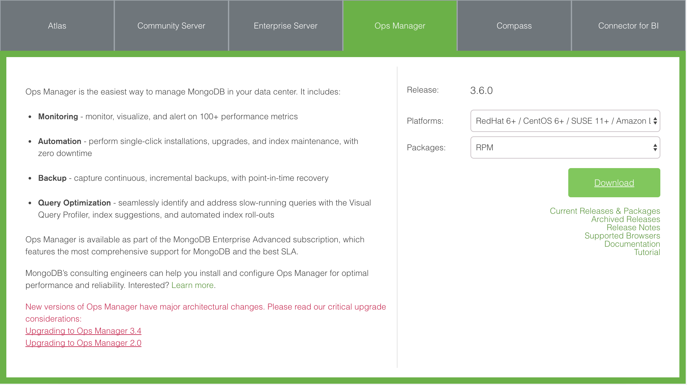

## Synopsis

This directory contains details and instructions to help you get set up to deploy a MongoDB Opsmanager instance along with a MongoDB replica set.

## Overview
This repository contains playbooks and scripts designed to automate the process of deploying, and configuring MongoDB Opsmanager for the purpose of demonstrating how you will improve the efficiency managing your MongoDB implementation using Opsmanager.

Opsmanager was designed to help manage MongoDB across 4 key categories of activities:

1. Monitoring
2. Optimization
3. Automation
4. Backup

## Prerequisites

In order to begin showing the power and flexibility of Opsmanager, we first need to set up our environment.  We're using [Ansible](http://ansible.com) to automate deployment and configuration of our instances.  We're also relying on [Amazon EC2](https://aws.amazon.com/ec2) for hosting of our instances.  While you may deploy local instances on your desktop/laptop, instances in docker, or in VMWare, we'll focus on EC2 for the purpose of this demonstration.

1. Ansible

 - On Mac OS - simply type:

 ```
 brew install ansible
 ```
 
 For other OS's and additional information on Ansible, see the [Official Ansible Documentation Site](http://docs.ansible.com)

2. AWS SSH Keys

 - You need to have your working AWS Keys.  These will be used to enable you to deploy ec2 instances from ansible.
 - If you do not have working keys, visit this link for instructions: [AWS: Creating a Key Pair](http://docs.aws.amazon.com/AWSEC2/latest/UserGuide/ec2-key-pairs.html)
 - Place this key in the filesystem on your laptop - most likely in ~/.ssh
  - e.g. /Users/mlynn/.ssh/michael.lynn.pem
 - Modify the ansible.cfg file in the top level directory of this repo with the location of your key file.
  - private_key_file = /Users/mlynn/.ssh/michael.lynn.pem

3. Python VirtualEnvWrapper
	- We're going to be leveraging some python libraries.  This can be a maddening cycle of dependencies... unless you leverage a tool like virtualenvwrapper.  First - check this out: [Virtualenvwrapper.readthedocs.io](https://virtualenvwrapper.readthedocs.io/en/latest/)

```
$ pip install virtualenvwrapper

...
$ export WORKON_HOME=~/Envs
$ mkdir -p $WORKON_HOME
$ source /usr/local/bin/virtualenvwrapper.sh
$ mkvirtualenv env1
Installing
setuptools..........................................
....................................................
....................................................
...............................done.
virtualenvwrapper.user_scripts Creating /Users/dhellmann/Envs/env1/bin/predeactivate
virtualenvwrapper.user_scripts Creating /Users/dhellmann/Envs/env1/bin/postdeactivate
virtualenvwrapper.user_scripts Creating /Users/dhellmann/Envs/env1/bin/preactivate
virtualenvwrapper.user_scripts Creating /Users/dhellmann/Envs/env1/bin/postactivate  New python executable in env1/bin/python
(env1)$ ls $WORKON_HOME
env1 hook.log
```

3. Boto

Boto is a Python package that provides interfaces to Amazon Web Services. Currently, all features work with Python 2.6 and 2.7. Work is under way to support Python 3.3+ in the same codebase.

This solution leverages the boto library for python for the creation of the ansible-hosts file from the AWS inventory.  To install boto - use the following command:

```
pip install boto3
```

4. Put your AWS Keys in place - ~/.aws/credentials:

```sh
[default]
aws_access_key_id = IOEPXX2LODTX4PGGZNJQ
aws_secret_access_key = $DAKS)f94la00s901eBLbAh+7KjFoVZ
```

5. Create your ansible.cfg file (from the example):

```sh
cp ansible.cfg.example ansible.cfg
```

6. Replace the name of your AWS Key in the ansible.cfg file:
```
[defaults]
host_key_checking = False
nocows=1
private_key_file = /Users/mlynn/.ssh/michael.lynn.pem <----Location of your key
log_path=logs/ansible.log

[ssh_connection]
control_path = %(directory)s/%%C
```

7. Put your aws credentials in your .bash_profile

```
export AWS_ACCESS_KEY_ID='AYOURKEYHEREKIAJT2LODTX4PGGZNJQ'
export AWS_SECRET_ACCESS_KEY='ryYceYOURSECRETKEYHEREBLbAh+7KjFoVZ'
```

Be certain to source your updated .bash_profile

```
source ~/.bash_profile
```

## Getting Setup

Once you have the prereqs squared away, you're ready to begin either getting your nodes deployed for demo, or if you already have nodes deployed, you can skip this next section.

### Opsmanager Package



In order for us to deploy Opsmanager, we need to download the opsmanager package from the MongoDB/Downloads site.  Visit [MongoDB/Downloads/Opsmanager](https://www.mongodb.com/download-center#ops-manager) and download the latest package version.  Place the downloaded package RPM in the [files](./files) directory.

At the time this is being written, the package version is as follows:

```mongodb-mms-3.6.0.582-1.x86_64.rpm```

To deploy this package, I've hard-coded a reference to this version in the Ansible playbook that installs the package.  If you've downloaded a different version, you will need to update the reference in the playbook.  Here's a look at the playbook:

```
---
- hosts: opsManager
  remote_user: ec2-user
  become: yes
  vars:
    opsmanagerGPG: mongodb-mms-3.4.7.479-1.x86_64.rpm.gpg
    opsmanager: mongodb-mms-3.6.0.582-1.x86_64.rpm
  tasks:
    - copy: src=../files/{{ opsmanager }} dest=/home/ec2-user/{{opsmanager}}
    - yum: name=/home/ec2-user/{{opsmanager}} state=present
    - service: name=mongodb-mms state=started

```

Change line 7 to match the name of the version package you've downloaded.

### Node Deployment

Ansible automates the process of package deployment, configuration as well as node deployment.  In this section, we're going to leverage Ansible's ability to connect directly to AWS/EC2 to deploy new instances for our demo.

To speed things up - I'll leave you to work out those details as we'll not have time to leverage the EC2 Automation for this demo.

So - You'll want to deploy one M3.xlarge for your Ops Manager machine and 3 t2.small's.  Here's our architecture:

```
+----------------+                               +---------------+
|                |                               | (t2.small)    |
|  OPS MANAGER   |                               |    PRIMARY    |
|                |                               +---------------+
| (m3.xlarge)    |       +-----------------------+ OM AGENT      |
|                |       |                       +-------+-------+
+---------+------+       |                               |
          |              |                  +------------+-----------+
          |              |                  |                        |
          |              |          +-------v-------+        +-------v-------+
          |              |          | (t2.small)    |        | (t2.small)    |
          |              |          |   SECONDARY   |        |   SECONDARY   |
          |              |          +---------------+        +---------------+
          +--------------+          | OM AGENT      |        | OM AGENT      |
          |                         +-------+-------+        +-------+-------+
          |                                 |                        |
          |                                 |                        |
          |                                 |                        |
          |                                 |                        |
          +---------------------------------+------------------------+

```

### Deploying Nodes to AWS/EC2

The first thing we'll need to accomplish is getting our Ops Manager node deployed.  Since the application requirements are pretty decent, we'll leverage an M3 Instance.  Here's what that looks like in terms of resource:

To deploy your own instances, I've simplified the process of executing the necessary scripts by numbering them logically.

- Deploy Opsmanager ([`1_deploy_ec2_opsmgr.sh`](https://github.com/mrlynn/ansible-opsmanager-demo/blob/master/1_deploy_ec2_opsmgr.sh))

	Here, we're deploying the EC2 instances that will host the Opsmanager software.  You can view the specific documentation to accomplish this independently [here](https://docs.opsmanager.mongodb.com/current/tutorial/install-simple-test-deployment/)

- Deploy Replicaset Members ([`2_deploy_ec2_replset.sh`](https://github.com/mrlynn/ansible-opsmanager-demo/blob/master/2_deploy_ec2_replset.sh))


- Create / Update Ansible Hosts File ([`3_create_ansible-hosts.sh`](https://github.com/mrlynn/ansible-opsmanager-demo/blob/master/3_create_ansible-hosts.sh))

- Install Opsmanager ([`4_install_opsmanager.sh`](https://github.com/mrlynn/ansible-opsmanager-demo/blob/master/4_install_opsmanager.sh))

- Onboard Replica Set Members into Opsmanager ([`5_onboard_replset.sh`](https://github.com/mrlynn/ansible-opsmanager-demo/blob/master/5_onboard_replset.sh))

